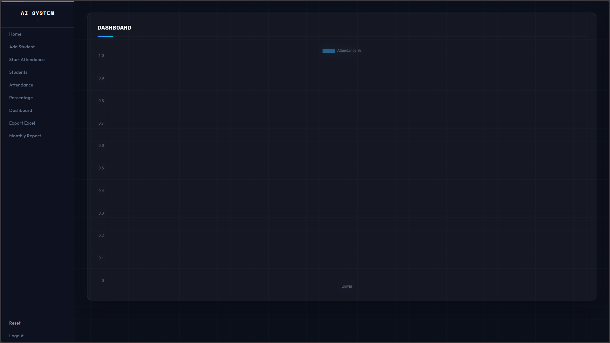
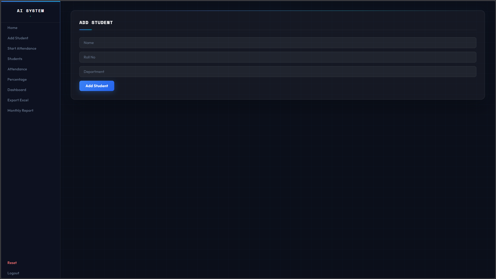
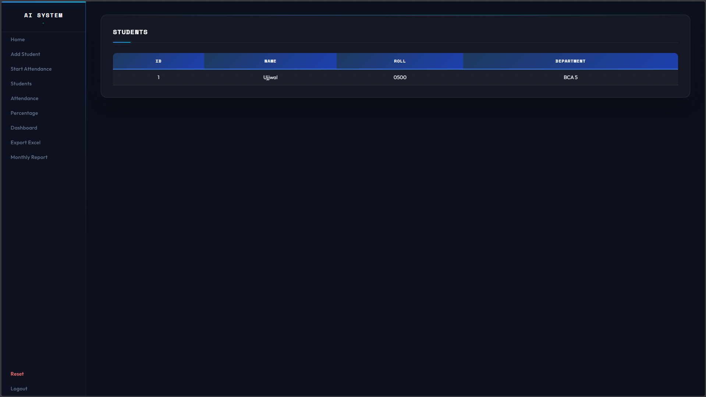
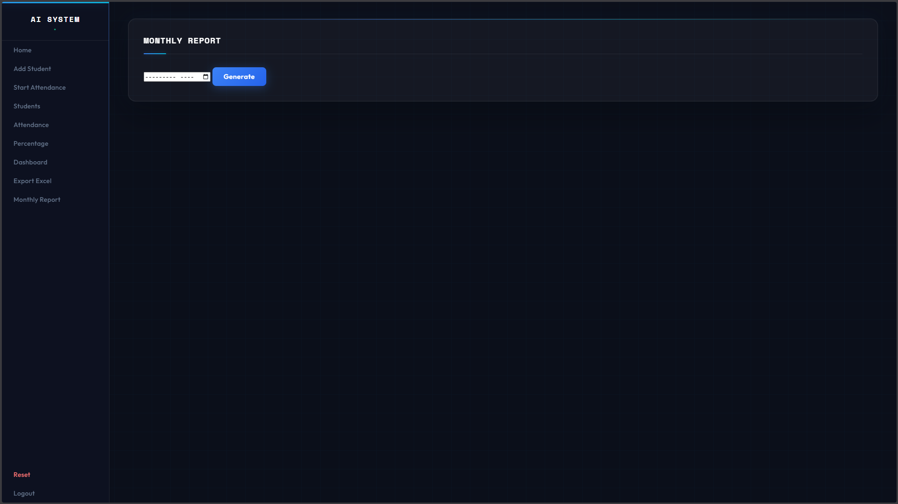

# 🎓 AI-Based Smart Attendance System Using Face Recognition

An intelligent attendance system that uses **Face Recognition** to automatically mark attendance in real-time using a webcam.

---

## 🚀 Overview

This project eliminates manual attendance by using **AI-based facial recognition**.  
It detects faces, compares them with stored data, and records attendance instantly.

---

## ✨ Key Features

- ✅ Face Recognition Attendance (Real-time)
- ✅ Admin Login System
- ✅ Add & Manage Students
- ✅ Automatic Attendance Marking
- ✅ Prevent Duplicate Entries
- ✅ Attendance Percentage Calculation
- ✅ Monthly Attendance Reports
- ✅ Excel Export
- ✅ Dashboard with Graphs
- ✅ Unknown Face Detection
- ✅ Reset System

---

## 🛠️ Tech Stack

| Layer       | Technology |
|------------|-----------|
| Frontend   | HTML, CSS, JavaScript |
| Backend    | Python (Flask) |
| AI         | OpenCV, face_recognition |
| Database   | SQLite |
| Tools      | VS Code, Webcam |

---

## 🧠 How It Works

1. Admin registers a student  
2. System captures face images  
3. Images are converted into face encodings  
4. During attendance:
   - Webcam detects faces  
   - Encodings are compared  
   - If matched → attendance marked  

---

📸 Screenshots

 🏠 Dashboard


 ➕ Add Student


 👥 Students List


 📋 Admin Login


 📅 Monthly Report


---

## ⚙️ Installation

```bash
git clone https://github.com/yourusername/AI-Attendance-System.git
cd AI-Attendance-System
pip install -r requirements.txt
python app.py

▶️ Usage
Login as admin
Add student
Capture face
Start attendance
View reports

⚠️ Limitations
Requires webcam
Lighting conditions affect accuracy
Runs locally (camera access needed)

🔮 Future Improvements
Cloud deployment
Mobile application
Multi-camera support
Face mask detection
ERP integration

👨‍💻 Author
Ujjwal Ray
BCA 6th Semester
